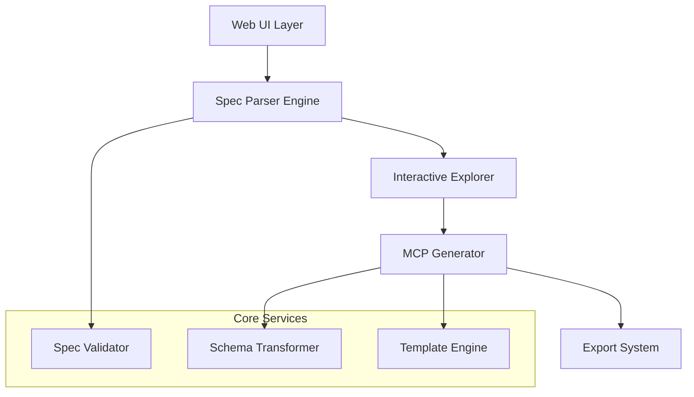

# Design Document

## Overview

The API Spec Explorer is a single-page web application that transforms API specifications into interactive exploration tools and generates Python MCP servers. The application follows a progressive workflow: input → parsing → exploration → generation → export, with each phase building upon the previous one.

The system is designed as a client-side application with optional backend services for enhanced functionality, prioritizing developer experience and practical utility.

## Architecture

### High-Level Architecture



### Technology Stack

**Frontend:**
- **Framework**: React 18 with TypeScript
- **State Management**: Zustand for lightweight state management
- **UI Components**: Tailwind CSS + Headless UI for consistent design
- **Code Editor**: Monaco Editor for code preview and editing
- **File Handling**: Browser File API for uploads

**Core Libraries:**
- **API Parsing**: swagger-parser for OpenAPI spec parsing
- **Schema Validation**: Ajv for JSON schema validation
- **YAML Processing**: js-yaml for YAML file support
- **HTTP Client**: Axios for fetching remote specs
- **Code Generation**: Handlebars for template-based code generation

**Development Tools:**
- **Build System**: Vite for fast development and building
- **Testing**: Vitest + React Testing Library
- **Linting**: ESLint + Prettier for code quality

## Components and Interfaces

### 1. Input Handler Component

**Purpose**: Manages API specification input through file upload or URL

**Interface**:
```typescript
interface InputHandlerProps {
  onSpecLoaded: (spec: ParsedSpec, metadata: InputMetadata) => void;
  onError: (error: InputError) => void;
}

interface InputMetadata {
  source: 'file' | 'url';
  filename?: string;
  url?: string;
  authHeaders?: Record<string, string>;
}

interface InputError {
  type: 'network' | 'parsing' | 'validation';
  message: string;
  details?: any;
}
```

**Key Features**:
- Drag-and-drop file upload
- URL input with authentication toggle
- Custom header configuration
- Real-time validation feedback
- Progress indicators for remote fetching

### 2. Spec Parser Engine

**Purpose**: Parses and validates OpenAPI specifications

**Interface**:
```typescript
interface SpecParser {
  parse(input: string | object): Promise<ParsedSpec>;
  validate(spec: ParsedSpec): ValidationResult;
  extractEndpoints(spec: ParsedSpec): Endpoint[];
}

interface ParsedSpec {
  version: '2.0' | '3.0' | '3.1';
  info: SpecInfo;
  servers?: Server[];
  paths: Record<string, PathItem>;
  components?: Components;
  tags?: Tag[];
}

interface Endpoint {
  id: string;
  method: HttpMethod;
  path: string;
  operationId?: string;
  summary?: string;
  description?: string;
  tags?: string[];
  parameters?: Parameter[];
  requestBody?: RequestBody;
  responses: Record<string, Response>;
  security?: SecurityRequirement[];
}
```

**Key Features**:
- Support for OpenAPI 2.0, 3.0, and 3.1
- Comprehensive validation with detailed error reporting
- Endpoint extraction and normalization
- Schema resolution and dereferencing
- Tag and operation grouping

### 3. Interactive Explorer Component

**Purpose**: Provides interactive browsing of API endpoints

**Interface**:
```typescript
interface ExplorerProps {
  endpoints: Endpoint[];
  onEndpointSelect: (endpoint: Endpoint) => void;
  onMCPGenerate: (selectedEndpoints: Endpoint[]) => void;
}

interface ExplorerState {
  groupBy: 'tags' | 'paths' | 'methods';
  searchQuery: string;
  selectedEndpoints: Set<string>;
  expandedGroups: Set<string>;
  viewMode: 'tree' | 'table' | 'cards';
}
```

**Key Features**:
- Multiple view modes (tree, table, cards)
- Smart grouping and filtering
- Search with fuzzy matching
- Endpoint selection for MCP generation
- Detailed endpoint inspection
- Schema visualization

### 4. MCP Generator Engine

**Purpose**: Generates Python MCP server code from selected endpoints using fastmcp framework

**Interface**:
```typescript
interface MCPGenerator {
  generateServer(config: MCPConfig): Promise<GeneratedProject>;
  previewTool(endpoint: Endpoint, config: ToolConfig): MCPTool;
  validateConfiguration(config: MCPConfig): ValidationResult;
  generateFastMCPServer(config: MCPConfig): Promise<GeneratedProject>;
}

interface MCPConfig {
  endpoints: Endpoint[];
  serverName: string;
  baseUrl: string;
  authentication?: AuthConfig;
  toolNaming: 'operationId' | 'path' | 'custom';
  includeExamples: boolean;
  errorHandling: 'basic' | 'detailed';
  // New fastmcp-specific options
  useFastMCP: boolean;
  serverModes: ('stdio' | 'http')[];
  httpPort: number;
  logLevel: 'DEBUG' | 'INFO' | 'WARNING' | 'ERROR';
  includeRunScripts: boolean;
}

interface GeneratedProject {
  files: Record<string, string>;
  structure: ProjectStructure;
  instructions: DeploymentInstructions;
  // Enhanced for fastmcp
  runScripts: Record<string, string>;
  dockerCompose?: string;
}
```

**Key Features**:
- Template-based code generation with fastmcp patterns
- Configurable tool naming strategies
- Authentication handling with fastmcp integration
- Enhanced error handling using fastmcp patterns
- Complete project structure generation
- Deployment instructions for both stdio and HTTP modes
- Helper scripts for local development

### 5. Export System

**Purpose**: Handles project export and deployment guidance

**Interface**:
```typescript
interface ExportSystem {
  exportProject(project: GeneratedProject): Promise<ExportResult>;
  generateReadme(config: MCPConfig): string;
  createEnvTemplate(authConfig: AuthConfig): string;
  packageProject(project: GeneratedProject): Blob;
}

interface ExportResult {
  downloadUrl: string;
  filename: string;
  size: number;
  structure: string[];
}
```

## Data Models

### Core Data Structures

```typescript
// API Specification Models
interface SpecInfo {
  title: string;
  version: string;
  description?: string;
  contact?: Contact;
  license?: License;
}

interface Parameter {
  name: string;
  in: 'query' | 'header' | 'path' | 'cookie';
  required: boolean;
  schema: Schema;
  description?: string;
  example?: any;
}

interface Schema {
  type?: string;
  format?: string;
  properties?: Record<string, Schema>;
  items?: Schema;
  required?: string[];
  enum?: any[];
  example?: any;
}

// MCP Generation Models
interface MCPTool {
  name: string;
  description: string;
  inputSchema: JSONSchema;
  outputSchema?: JSONSchema;
  implementation: string;
}

interface AuthConfig {
  type: 'none' | 'apiKey' | 'bearer' | 'basic' | 'oauth2';
  location?: 'header' | 'query';
  name?: string;
  envVar: string;
}

interface ProjectStructure {
  rootDir: string;
  files: FileStructure[];
  dependencies: string[];
}
```

### State Management

Using Zustand for lightweight, type-safe state management:

```typescript
interface AppState {
  // Input phase
  inputSpec: ParsedSpec | null;
  inputMetadata: InputMetadata | null;
  
  // Explorer phase
  endpoints: Endpoint[];
  selectedEndpoints: Set<string>;
  explorerConfig: ExplorerState;
  
  // Generator phase
  mcpConfig: MCPConfig;
  generatedProject: GeneratedProject | null;
  
  // UI state
  currentPhase: 'input' | 'explorer' | 'generator' | 'export';
  loading: boolean;
  error: string | null;
}
```

## Error Handling

### Error Categories

1. **Input Errors**:
   - Invalid file format
   - Network failures for remote URLs
   - Authentication failures
   - Malformed specifications

2. **Parsing Errors**:
   - Schema validation failures
   - Unsupported OpenAPI versions
   - Missing required fields
   - Circular references

3. **Generation Errors**:
   - Template rendering failures
   - Invalid endpoint configurations
   - Missing authentication details
   - Code generation conflicts

### Error Handling Strategy

```typescript
interface ErrorHandler {
  handleInputError(error: InputError): void;
  handleParsingError(error: ParsingError): void;
  handleGenerationError(error: GenerationError): void;
  recoverFromError(error: AppError): boolean;
}

// Error Recovery Patterns
const errorRecovery = {
  inputError: () => resetToInputPhase(),
  parsingError: () => showValidationDetails(),
  generationError: () => fallbackToBasicGeneration(),
  networkError: () => retryWithExponentialBackoff()
};
```

### User Feedback System

- **Toast Notifications**: For quick feedback on actions
- **Inline Validation**: Real-time validation during input
- **Error Panels**: Detailed error information with suggested fixes
- **Progress Indicators**: Clear feedback during long operations
- **Recovery Actions**: One-click recovery from common errors

## Testing Strategy

### Unit Testing

- **Parser Engine**: Test OpenAPI parsing with various spec formats
- **Generator Engine**: Test MCP code generation with different configurations
- **Utility Functions**: Test schema transformation and validation logic
- **State Management**: Test state transitions and data flow

### Integration Testing

- **End-to-End Workflows**: Test complete user journeys from input to export
- **API Integration**: Test remote spec fetching with various authentication methods
- **File Operations**: Test upload, download, and export functionality
- **Error Scenarios**: Test error handling and recovery paths

### Testing Tools

```typescript
// Example test structure
describe('SpecParser', () => {
  it('should parse OpenAPI 3.0 specs correctly', async () => {
    const spec = await parser.parse(openapi30Sample);
    expect(spec.version).toBe('3.0');
    expect(spec.paths).toBeDefined();
  });

  it('should handle authentication headers for remote specs', async () => {
    const headers = { 'Authorization': 'Bearer token' };
    const spec = await parser.parseFromUrl(url, { headers });
    expect(spec).toBeDefined();
  });
});
```

### Performance Testing

- **Large Spec Handling**: Test with APIs containing 100+ endpoints
- **Memory Usage**: Monitor memory consumption during parsing and generation
- **Bundle Size**: Ensure client-side bundle remains reasonable
- **Load Times**: Test initial load and phase transition performance

## Security Considerations

### Client-Side Security

1. **Input Sanitization**: Sanitize all user inputs and uploaded files
2. **XSS Prevention**: Proper escaping in code preview and generated content
3. **CORS Handling**: Proper handling of cross-origin requests for remote specs
4. **File Upload Security**: Validate file types and sizes

### Authentication Security

1. **Credential Handling**: Never store API credentials in browser storage
2. **Environment Variables**: Generate secure .env templates
3. **Token Exposure**: Warn users about token security in generated code
4. **HTTPS Enforcement**: Encourage HTTPS for all API communications

### Generated Code Security

```python
# Example security patterns in generated MCP servers
import os
from typing import Optional

class SecureAPIClient:
    def __init__(self):
        self.api_key = os.getenv('API_KEY')
        if not self.api_key:
            raise ValueError("API_KEY environment variable is required")
    
    def make_request(self, endpoint: str, **kwargs):
        # Implement secure request handling
        headers = {'Authorization': f'Bearer {self.api_key}'}
        # Add request validation and sanitization
        return self._validated_request(endpoint, headers, **kwargs)
```

## Deployment and Hosting

### Client-Side Deployment

The application is designed as a static single-page application that can be deployed to:

- **Static Hosting**: Netlify, Vercel, GitHub Pages
- **CDN**: CloudFlare, AWS CloudFront
- **Self-Hosted**: Any web server capable of serving static files

### Generated MCP Server Deployment

The exported MCP servers can be deployed via:

1. **Local Development**: Direct Python execution
2. **Docker Containers**: Containerized deployment
3. **Cloud Functions**: AWS Lambda, Google Cloud Functions
4. **HTTP Streamables**: For easy sharing and testing
5. **Traditional Hosting**: VPS, dedicated servers

### Configuration Management

```yaml
# Example deployment configuration
deployment:
  static_site:
    build_command: "npm run build"
    publish_directory: "dist"
    environment:
      NODE_ENV: "production"
  
  mcp_server:
    runtime: "python3.9"
    requirements: "requirements.txt"
    environment_variables:
      - API_KEY
      - BASE_URL
```

This design provides a solid foundation for building a robust, user-friendly API specification explorer with MCP server generation capabilities. The modular architecture allows for incremental development and easy extension of features.